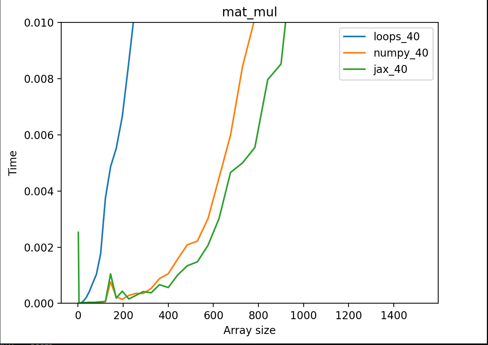

# Benchmark comparison of native loops vs Numpy vs JAX 

Python: `3.10.12`
Numpy: `1.26.3`
JAX: `0.4.26` ,CUDA 12.4

## Adding number to list benchmark

This experiment compares efficiency of adding single number to entire list done with native python lopps, numpy vs JAX.

Each list is converted into numpy array with Nx1 dimension or JAX numpy array before operation. However benchmark does not measure that time of conversion, it only focuses on measuring time of addition. 


## Multiplying list by number benchmark

This experiment compares efficiency of adding single number to entire list done with native python lopps, numpy vs JAX.

Each list is converted into numpy array with Nx1 dimension or JAX numpy array. However benchmark does not measure that time of conversion, it only focuses on measuring time of multiplication.


## Matrix multiplication benchmark

This experiment compares matrix multiplication done with native python lopps, numpy vs JAX.

Each matrix multiplication is done 40 times and averaged execution time is taken as result. All matricies are square size, samples indicate number of values in matrix.
For example `400` means that it is matrix 20x20 being multiplied with another 20x20. 




## Nvidia-smi

```
Fri Apr 19 19:43:39 2024       
+-----------------------------------------------------------------------------------------+
| NVIDIA-SMI 550.54.15              Driver Version: 550.54.15      CUDA Version: 12.4     |
|-----------------------------------------+------------------------+----------------------+
| GPU  Name                 Persistence-M | Bus-Id          Disp.A | Volatile Uncorr. ECC |
| Fan  Temp   Perf          Pwr:Usage/Cap |           Memory-Usage | GPU-Util  Compute M. |
|                                         |                        |               MIG M. |
|=========================================+========================+======================|
|   0  NVIDIA GeForce RTX 3060 ...    Off |   00000000:01:00.0 Off |                  N/A |
| N/A   68C    P0             18W /   60W |    4436MiB /   6144MiB |      0%      Default |
|                                         |                        |                  N/A |
+-----------------------------------------+------------------------+----------------------+
                                                                                         
+-----------------------------------------------------------------------------------------+
| Processes:                                                                              |
|  GPU   GI   CI        PID   Type   Process name                              GPU Memory |
|        ID   ID                                                               Usage      |
|=========================================================================================|
|    0   N/A  N/A      1923      G   /usr/lib/xorg/Xorg                              4MiB |
|    0   N/A  N/A      4585      C   python3                                      4414MiB |
+-----------------------------------------------------------------------------------------+
```
